# mc-server-dks
Welcome to my modded Minecraft server. In this document I will share **how to install Minecraft for free and join my server**.
This guide is a WIP. **Modlist is subject to change!** 

# Screenshots 

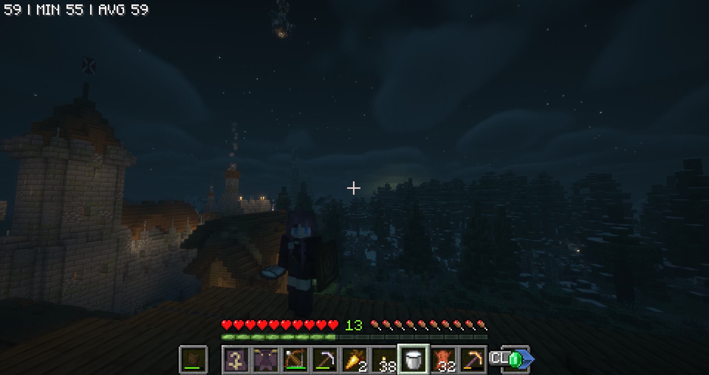

# Minecraft Installation 
- First install [Tlauncher](https://tlauncher.org/).
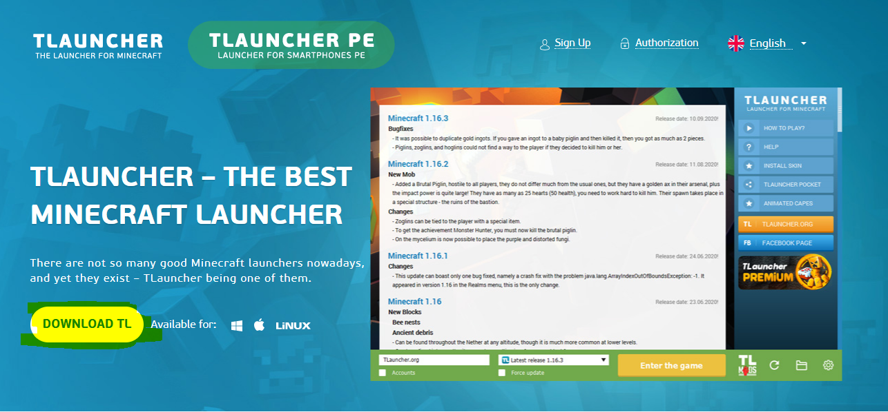

- Next open Tlauncher and set your username and the game version to **Forge 1.20.1** as shown.
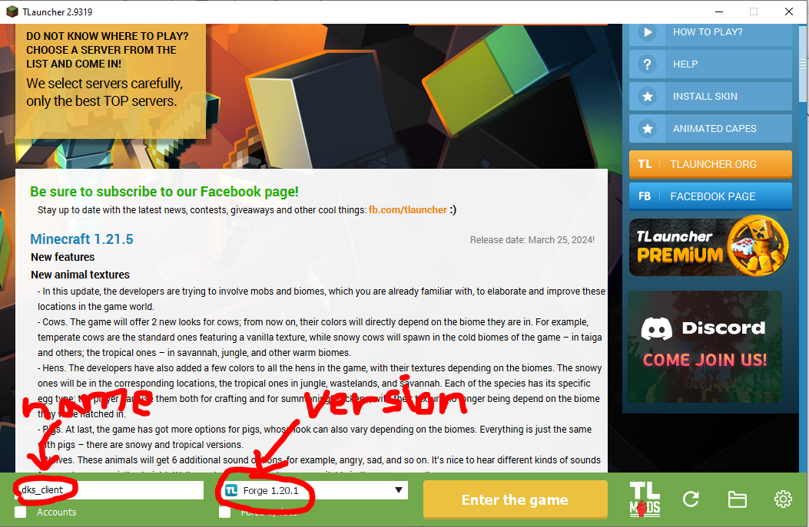

Optionally, configure a tlauncher account with your launcher to use custom skins.
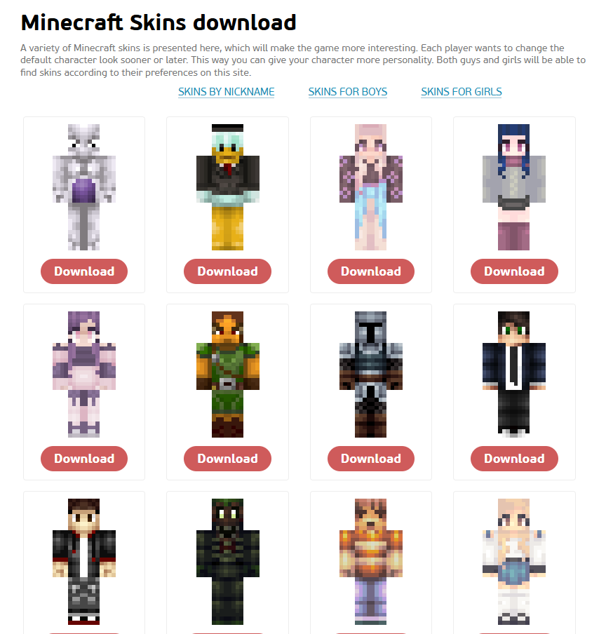
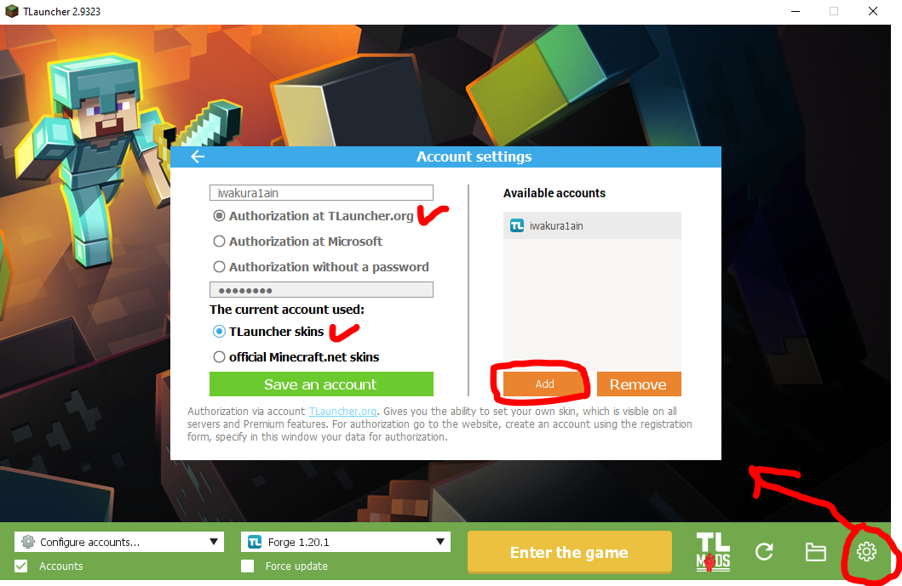

# Mod Installation
- Next click this icon as shown. It will take you to your Minecraft install directory.
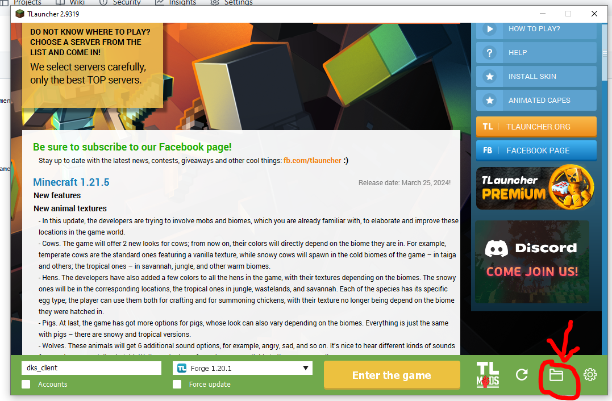

- Open the mods directory.
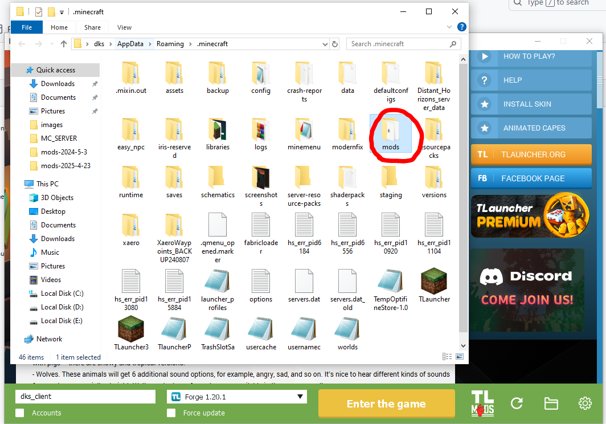

- Now download this [drive link](https://drive.google.com/drive/folders/1E7xYbUFOLAVrdf52SUSszAl6fgLk7asC?usp=drive_link) and paste the contents into the above mentioned mods directory.
  It should look something like this.
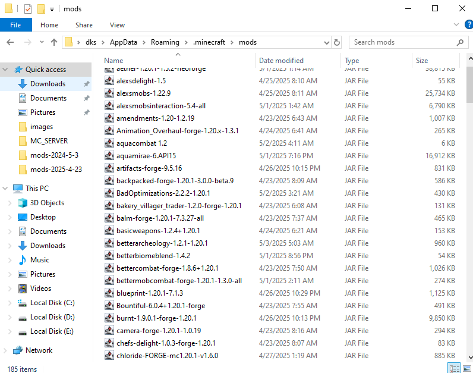

- Now you're ready to play!

# Join Server
- Open up the game and press Multiplayer.
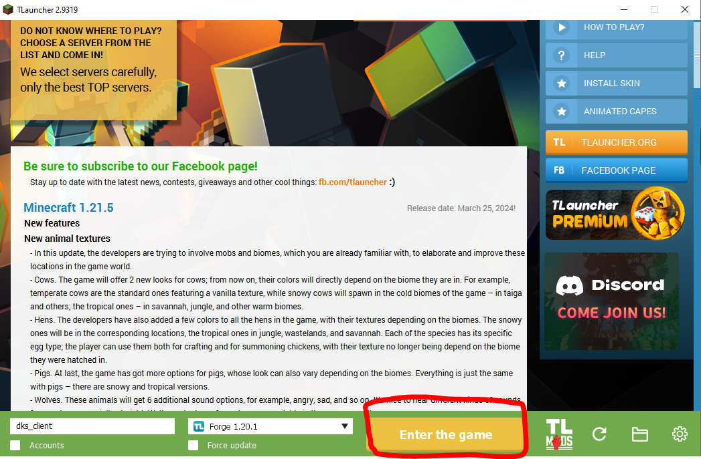

- Next go to Direct Connection.
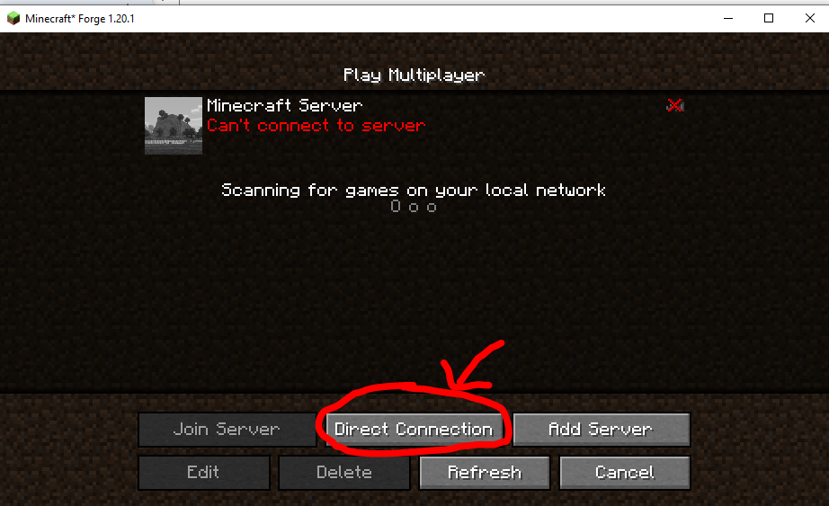

- And type in the following server details.
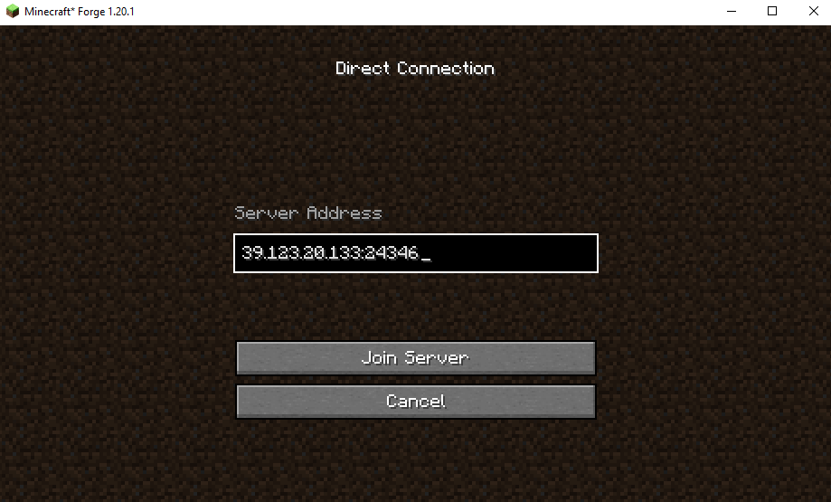

- Now enjoy!

# Shader Installation (Optional) 
- If you want your minecraft to look pretty and you know your pc can handle it, consider installing shaders.
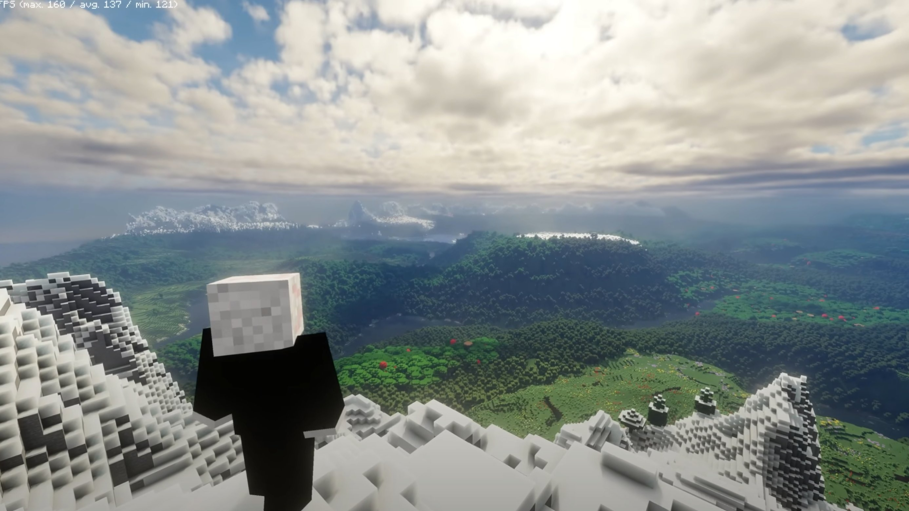
  
- Below are the shaders compatiable with this modlist (DistantHorizons compatible).
- [BSL Shaders](https://www.curseforge.com/minecraft/shaders/bsl-shaders)
- Complimentary

- Download the shader you want and unzip into the shaderpacks directory. Then select the shader from your ingame video settings.
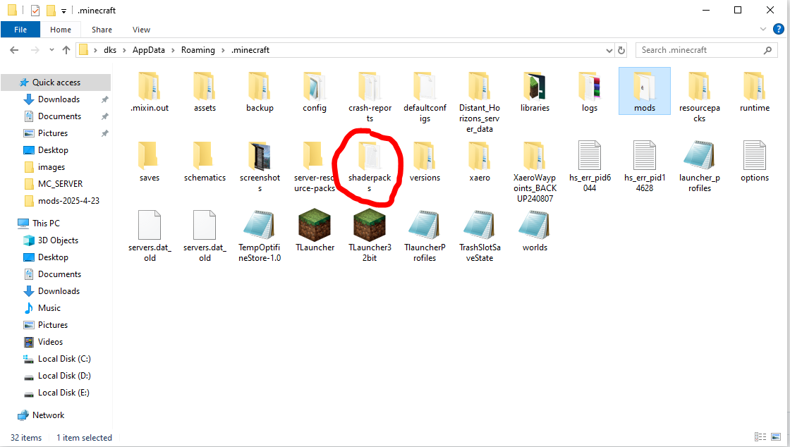

# Performance Settings (Game is too laggy) (WIP) (Optional)
- Set video settings to Fast(Performance)
- Disable Distant Horizons
- Disable Vsync
- Disable occulus

