# mc-server-dks
Welcome to my modded Minecraft server. In this document I will share **how to install Minecraft for free and join my server**.
This guide is a WIP. **Modlist is subject to change!** 

# Screenshots 

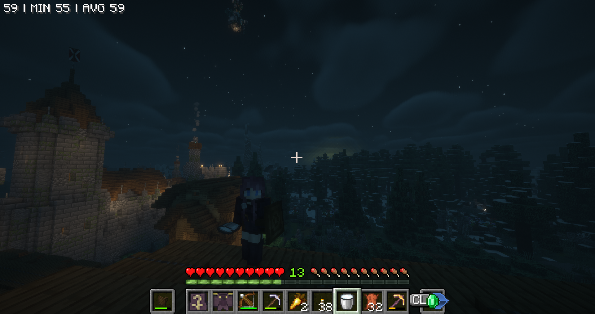

# Minecraft Installation 

- Install **Minecraft ver 1.20.1 Forge**
- 
- An easy way is to install [Tlauncher](https://tlauncher.org/).
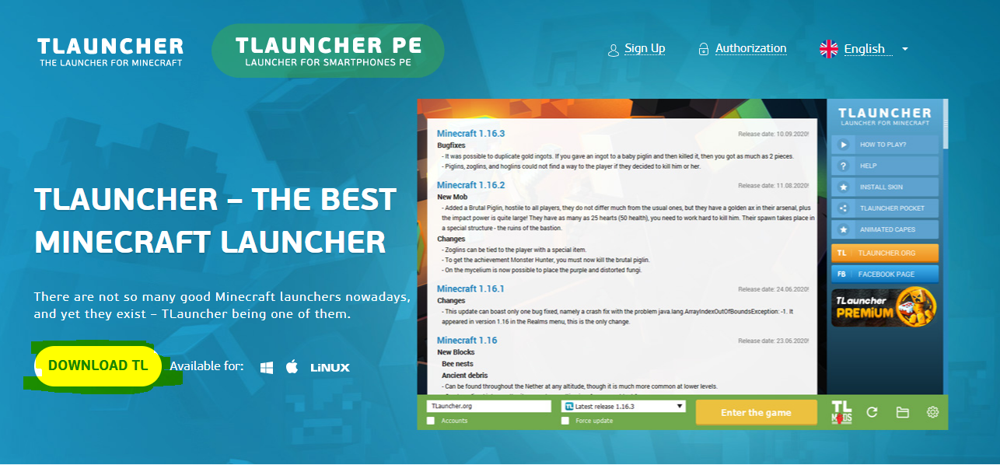

- Next open Tlauncher and set your username and the game version to **Forge 1.20.1** as shown.
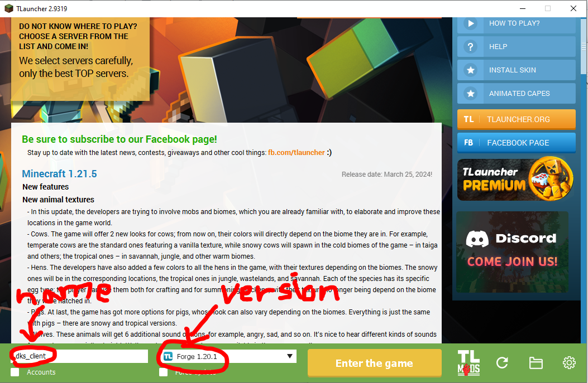

Optionally, configure a tlauncher account with your launcher to use custom skins.
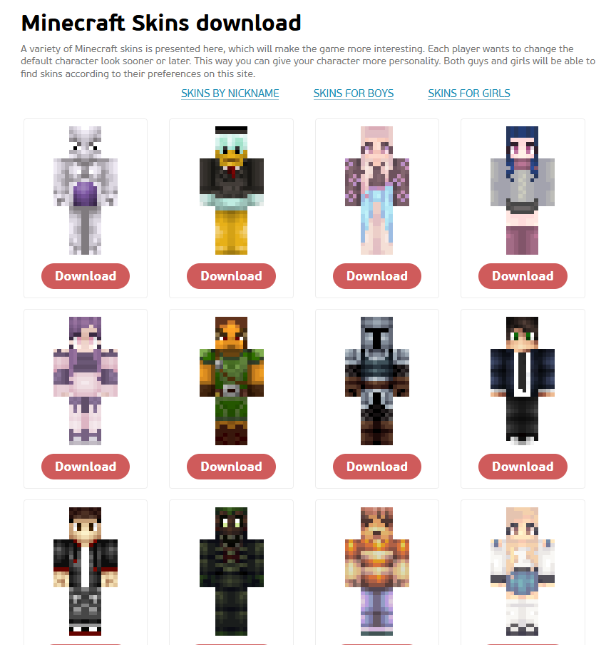
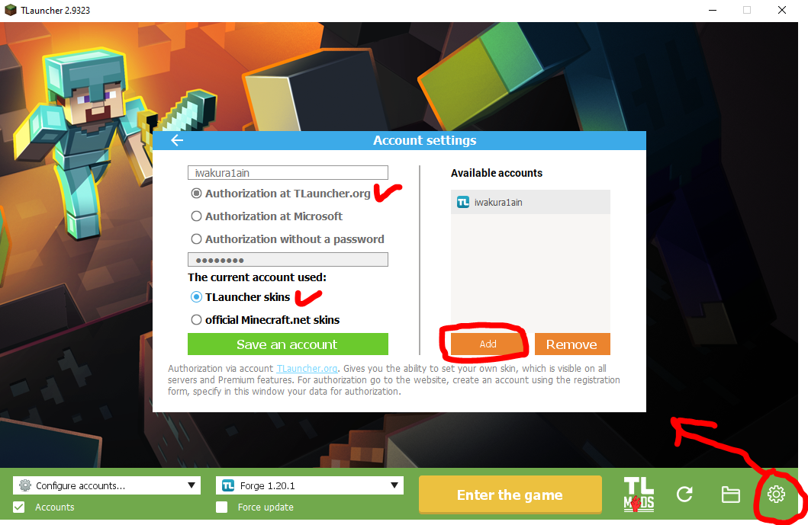

# Mod Installation
- Next click this icon as shown. It will take you to your Minecraft install directory.
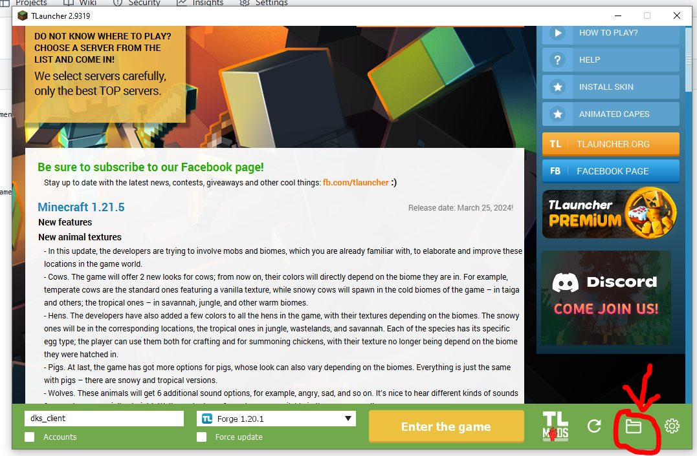

- Open the mods directory.
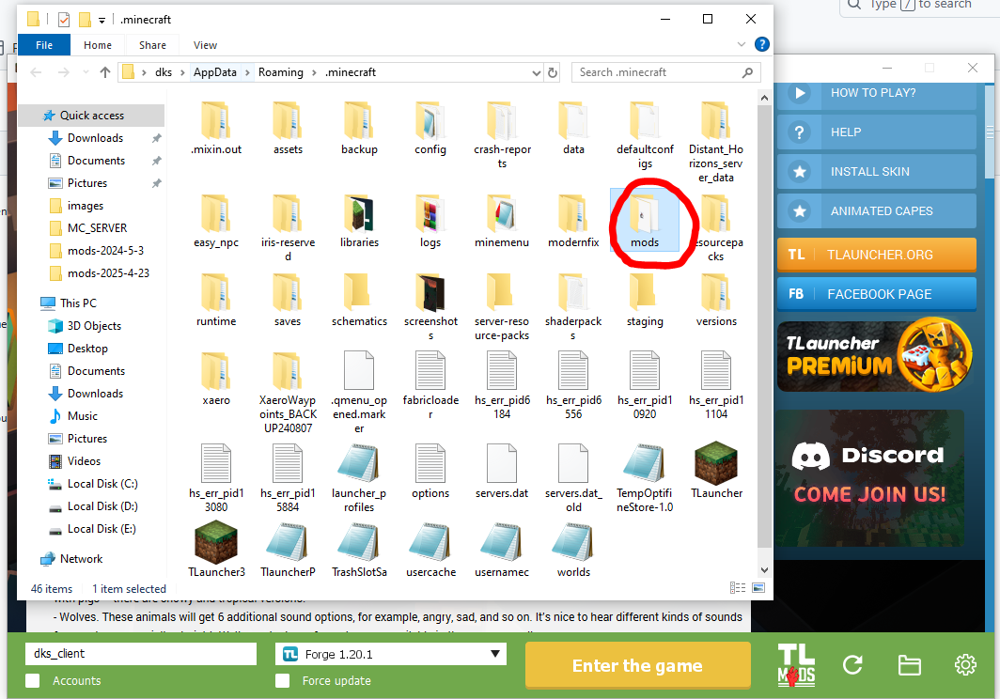

- Now download this [drive link](https://drive.google.com/file/d/10iRlU2-Ejff0xQLQK_F3JfukaO0md4g3/view?usp=sharing) and paste the contents into the above mentioned mods directory.
  The mods folder should look something like this.
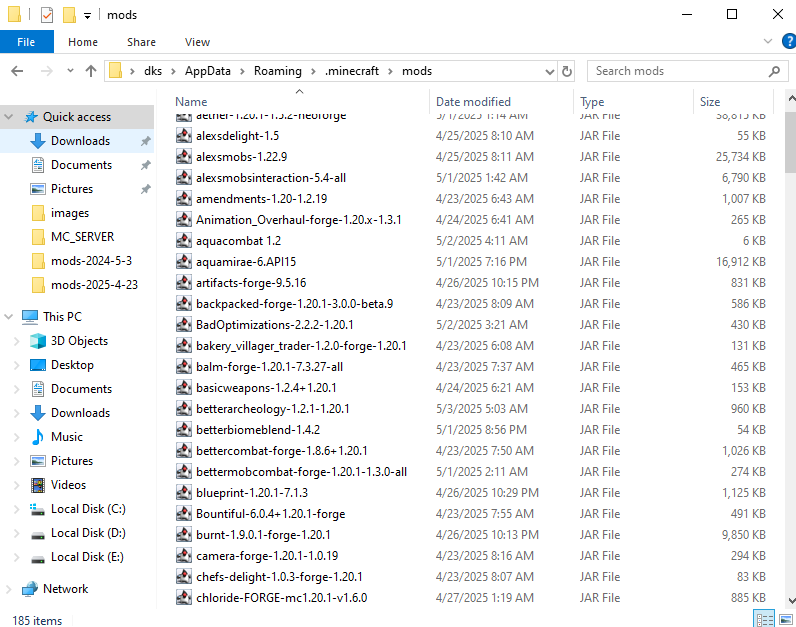

- Now you're ready to play!

# Join Server
- Open up the game and press Multiplayer.
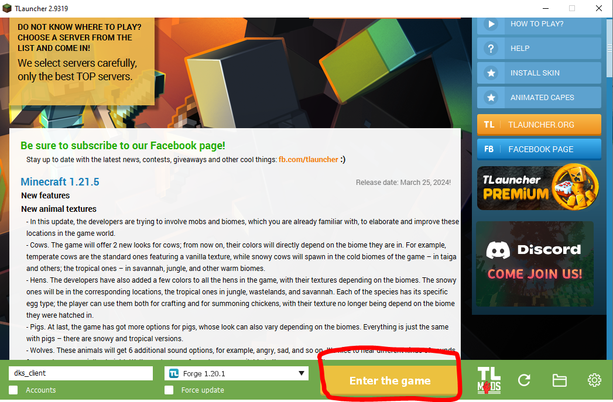

- Next go to Direct Connection.
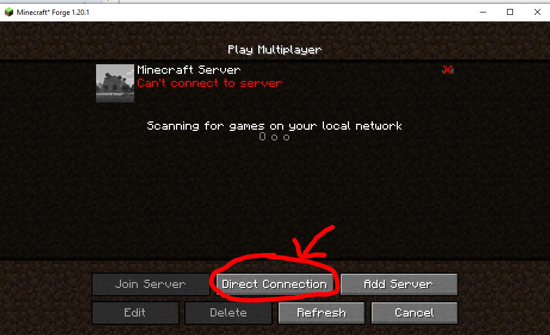

- And type in the following server details.
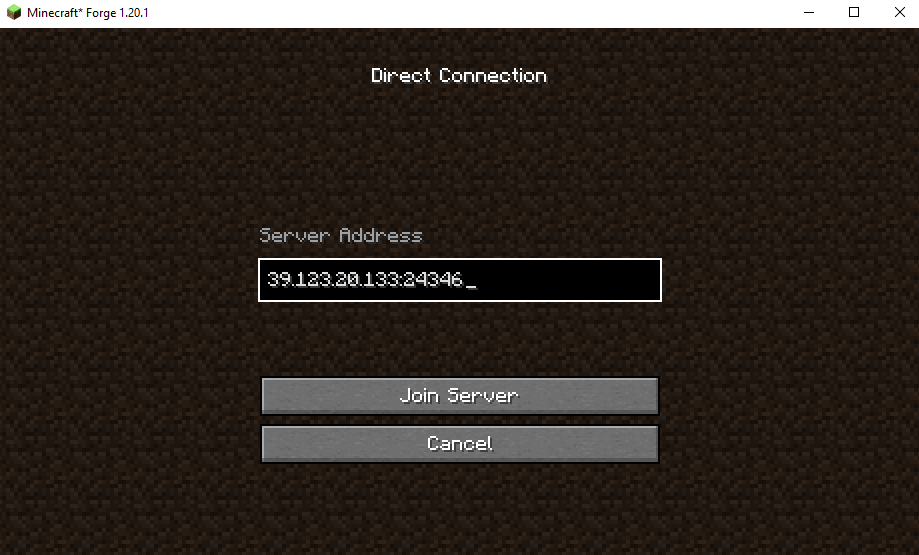

- Now enjoy!

# Shader Installation (Optional) 
- If you want your minecraft to look pretty and you know your pc can handle it, consider installing shaders.
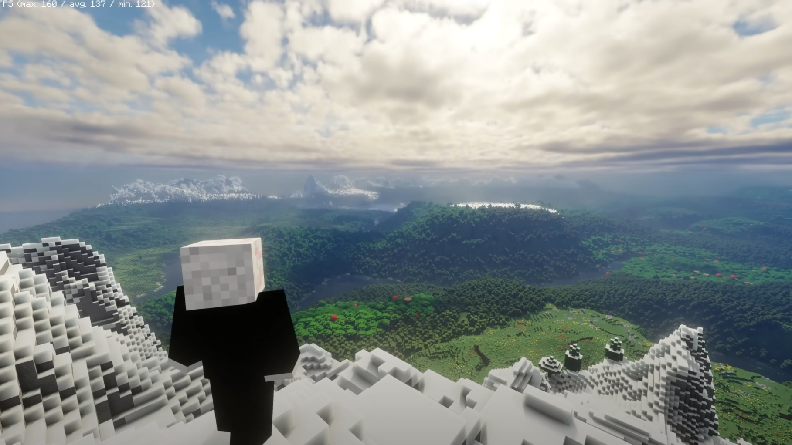
  
- Download shaderpacks and paste into your minecraft install directory
- [BSL Shaders](https://drive.google.com/file/d/1EP05kwGbbQLy0yG2QRKXQk5d4vcvv6r-/view?usp=sharing)

- Your minecraft install directory should look something like this.
- [Shaders](./images/15.png)

- Then select the shader from your ingame video settings. -> note: only shaders with the clrwl suffix are compatible 
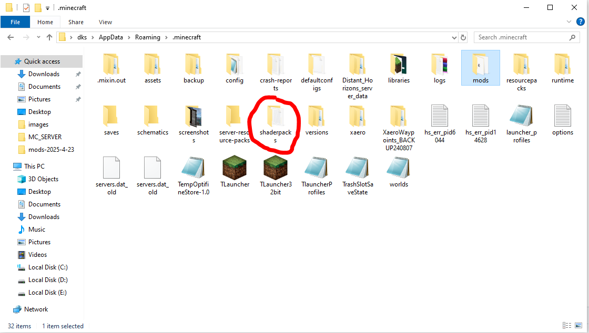

# Performance Settings (Game is too laggy) (WIP) (Optional)
- Set video settings to Fast(Performance)
- Disable Distant Horizons
- Disable Vsync
- Disable occulus

